# Project_1

# Project Idea

Is Washington Ready for the EV Revolution?

# Data Source

https://rapidapi.com/letscrape-6bRBa3QguO5/api/ev-charge-finder
- Charging Location 

https://fueleconomy.gov/feg/tax2023.shtml
- Tax Incentives 2023

https://catalog.data.gov/dataset/electric-vehicle-population-data
- Washington State Data

# Group Members 
Esha Patel, Ipsita Pattanaik, Jeff Morgan, Neil Lawren, Smita Shah
### PROJECT OUTINE

* Select the real-world data set from API/any other source.
* Download the dataset and convert it into a Pandas DataFrame.
* Perform data cleaning/deal with missing values using Pandas and NumPy.
* Plot interactive graphs to understand the data using visual libraries like matplotlib and hvplot.
* Ask and Answer questions from the dataset.

# Sub-Questions to be answered
1. Which cities in Washington have the most electric and plug-in-hybrid cars registered?
2. What is the ratio of cars to chargers in the selected cities? 
    - What is the availability of fast and slow charging ports per city?
3. What are the most popular car models in the selected cities and do they have federal incentive?

# Analysis
### Sub-QUESTION 1 ANALYSIS: Which cities in Washington have the most electric and hybrid cars registered?
#### Data Overview:
-	Total Rows: 159,106
-	Analysis Focus: Electric and Plug-in Hybrid Vehicles in Washington State, Top 5 Cities 

#### Data Analysis Steps:
-	Grouped data by city and state.
-	Counted VIN (1-10) for each city.
-	Identified top 5 cities with the highest counts.
-	Filtered cities with more than 5000 registered cars.

#### Top 5 Cities with most Electric Vechicles:
-	Bothell, Vancouver, Redmond, Bellevue, and Seattle.

#### Visualizations:
##### Bar Chart 1: Top 5 Cities with Highest EV and Plug-in-hybrid Cars Registered
-	Represents the top 5 cities based on registered electric and plug-in hybrid vehicles.
  
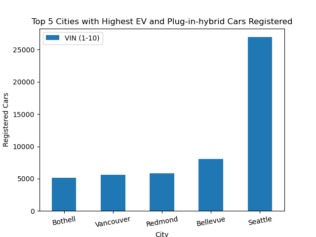 

##### Bar Chart 2: Total Chargers Available by Cities
-	Represents the total number of chargers available in the top 5 cities. The bar chart helps indicates the charging infrastructure in these cities.

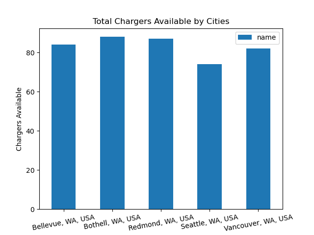 

#### Analysis: 
-	Bothell, Vancouver, Redmond, Bellevue, and Seattle emerge as key cities with significant car registrations.
-	This analysis provides insights into the distribution of electric and plug-in hybrid vehicles and the corresponding charging infrastructure in the specified top 5 cities in Washington State with highest number of registered cars.

### Sub-QUESTION 2 ANALYSIS:  What is the ratio of cars to chargers in the selected cities? What is the availability of fast and slow charging ports per city?
#### Reading Data:
-	The data is read from a CSV file and stored in the chargers_df DataFrame.

#### Filtering Data:
-	We have executed filters on the data for charging stations located in Bellevue, Bothell, Seattle, Vancouver, and Redmond, WA and storeed it in the relevant variables. 

#### Pie Chart:
- A pie chart is created to visualize the distribution of charging speeds for the selected top 5 cities with the greatest population of electric vehicles.

    <table>
	    <tr>
    	    <td style="padding:10px">
        	    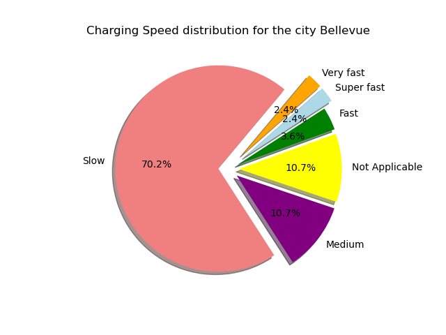
      	    </td>
            <td style="padding:10px">
            	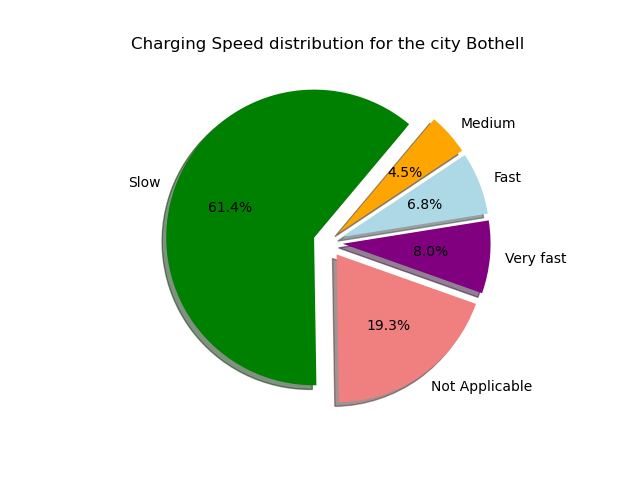
            </td>
            <td style="padding:10px">
            	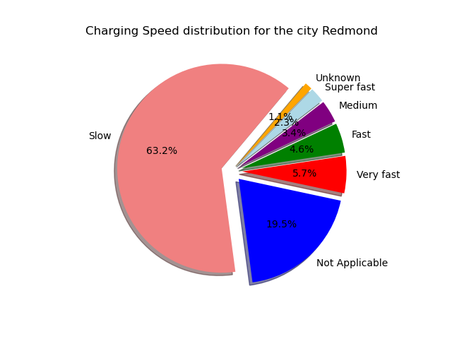
            </td>
        </tr>
    </table>

    <table>
	    <tr>
    	    <td style="padding:10px">
        	    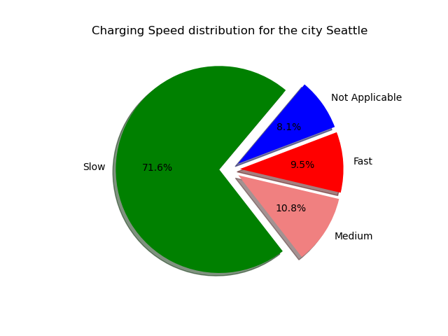
      	    </td>
            <td style="padding:10px">
            	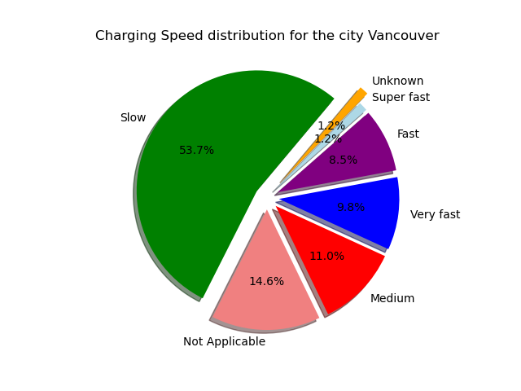
            </td>
        </tr>
    </table>

- A pie chart was also created to show charger distribution and car to charger ratio for the selected top 5 cities with the greatest population of electric vehicles. 

    <table>
	    <tr>
    	    <td style="padding:10px">
        	    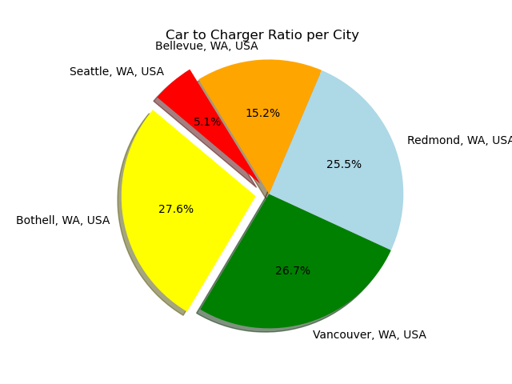
      	    </td>
            <td style="padding:10px">
            	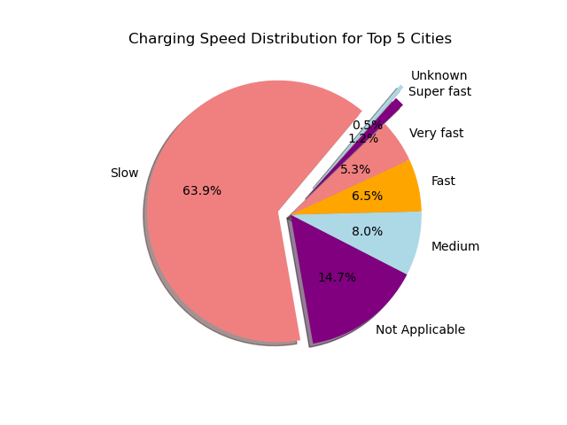
            </td>
        </tr>
    </table>

#### Map Plot:
- A map plot using hvplot.points is created to display the availability of charging stations near the selected cities on a map.

    <table>
	    <tr>
    	    <td style="padding:10px">
        	    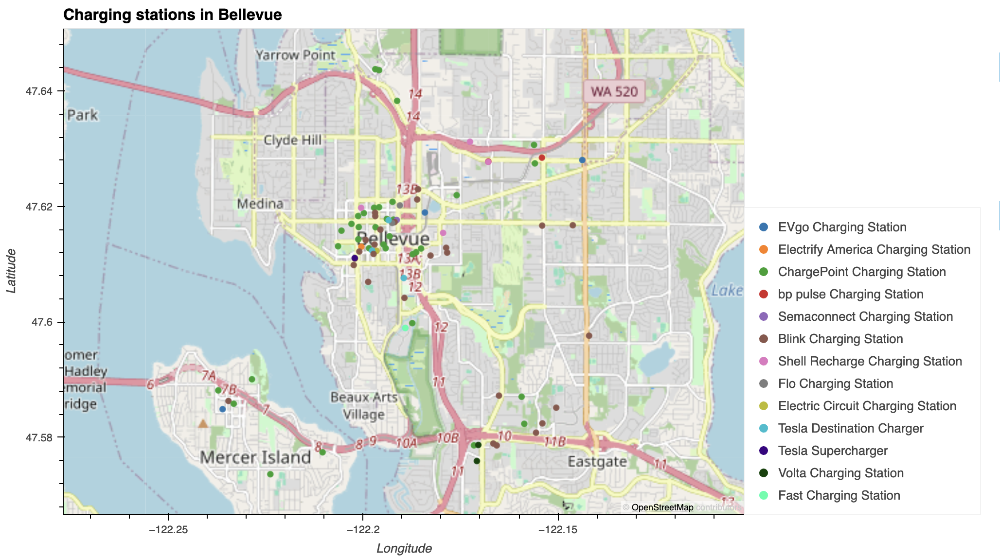
      	    </td>
            <td style="padding:10px">
            	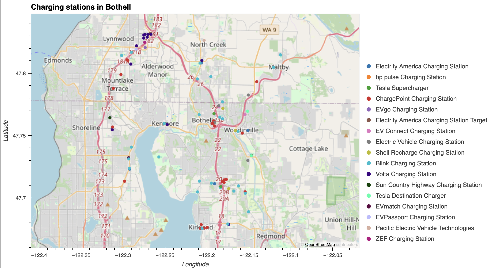
            </td>
            <td style="padding:10px">
            	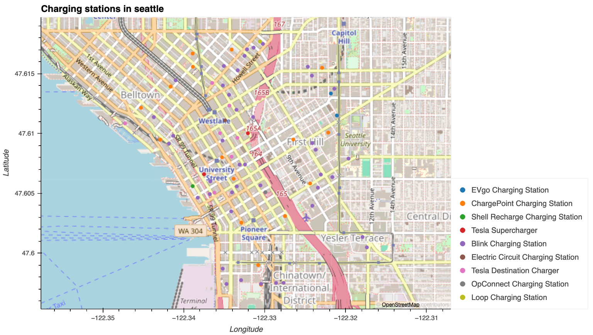
            </td>
        </tr>
    </table>

    <table>
	    <tr>
    	    <td style="padding:10px">
        	    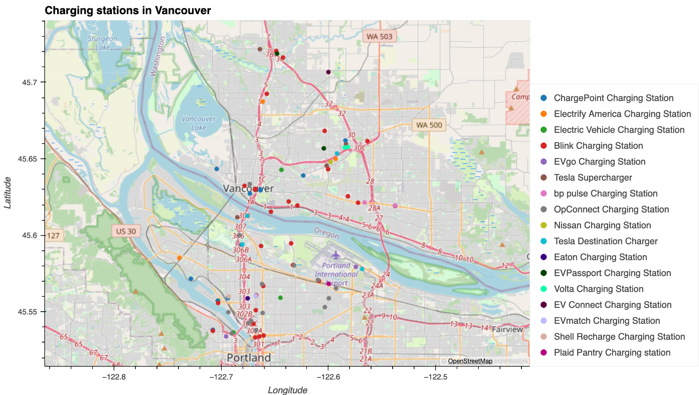
      	    </td>
            <td style="padding:10px">
            	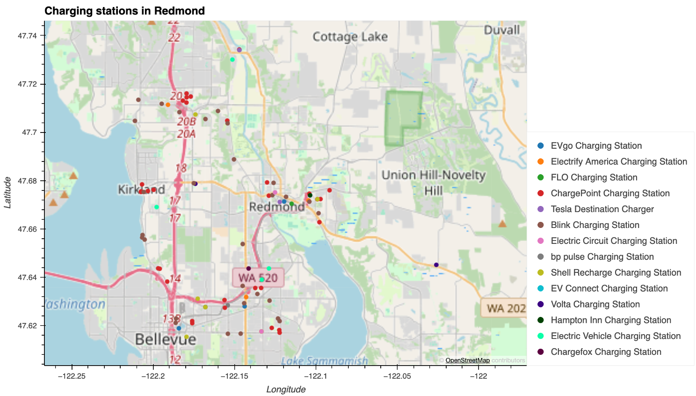
            </td>
        </tr>
    </table>

#### Analysis: 
- The analysis shows that overall the top 5 cities have more than 60% of slow chargers. Based on the data, we think that the cities need more fast chargers as it would not be sustainable if there were more electric cars registered per city. 

### Sub-QUESTION 3 ANALYSIS: Question 3: What are the most popular car models in the selected cities and do they have federal incentive?
#### Reading Data:
-	The data is read from a CSV file and stored in the tax_rebate_per_model_compressed_df Dataframe.

#### Merging Data:
-	We have merged the tax rebate data with our top 5 cities dataframe to calculate total for all top car models for selected 5 cities.

#### Bar Chart: Most Popular Car Models in all 5 Cities and WordCloud:
-	Represents the top 6 car models for all selected cities.
  

    <table>
	    <tr>
    	    <td style="padding:10px">
        	    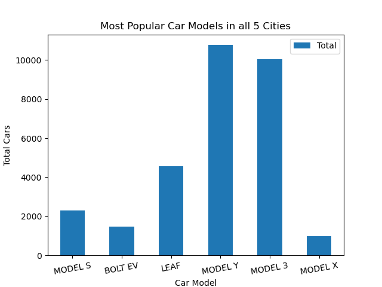
      	    </td>
            <td style="padding:10px">
            	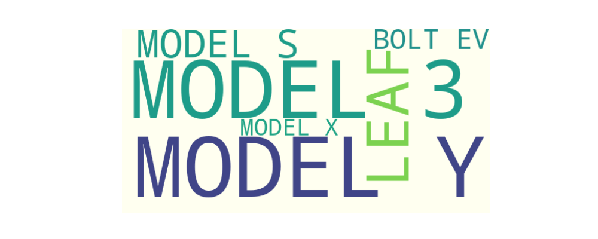
            </td>
        </tr>
    </table>

#### Analysis: 
- Based on our analysis, the most popular car choosen by buyers in selected cities is the TESLA Model Y. It  has a federal incentive of $7,500. We found that not all electric cars are eligible for federal tax incentives. 

# MAIN ANALYSIS: Is Washington Ready for the EV Revolution?
- Our research shows that Washington State may not be fully ready for the Electric Vehicle Revolution right now. We focused on the top 5 cities with the most registered electric vehicles and found a concerning lack of infrastructure to support widespread EV use.
- One main issue is the shortage of charging stations in these cities. Despite more electric vehicles on the road, the current charging infrastructure isn't keeping up with the growing demand. This lack of charging stations can be a big problem for EV owners, especially for those who can't easily charge near their homes or workplaces.
- Our research also indicates that most charging stations are relatively slow. This not only makes using EVs less convenient but could lead to practical issues like not having enough charge when needed. Some people believe that high-speed charging can affect the lifespan of an electric car's battery. However, modern electric vehicles usually have built-in systems to manage charging speed and battery temperature, reducing potential negative impacts.
- Apart from infrastructure challenges, our analysis stresses the importance of knowing about federal and state incentives when buying an electric vehicle. These incentives can significantly lower the overall cost of owning an EV and make them more financially appealing to consumers.
- In conclusion, our findings suggest that Washington State might need to invest more in building a strong charging infrastructure to support the increasing number of electric vehicles. Dealing with these infrastructure challenges and making people aware of available incentives is crucial for creating a better environment for the Electric Vehicle Revolution in the state.

# Limitations 

Limitations in the research arise from two key factors: limited time and funds, and challenges associated with data acquisition.

- The depth and thoroughness of the analysis were constrained by a shortage of time and financial resources. Comprehensive research often demands significant investments of time and money to gather extensive data, conduct thorough analyses, and ensure the accuracy of findings.
- Data acquisition faced challenges, particularly in relying on open-source data. Open-source data, while valuable, may be incomplete or outdated. This limitation can compromise the accuracy and relevance of the analysis, as the data used may not fully reflect the current state of the subject under investigation.
- Acknowledging these limitations is essential for a balanced understanding of the research findings and suggests areas for improvement in future studies. Thank You. Does anyone have any questions.
